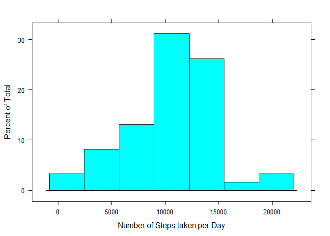
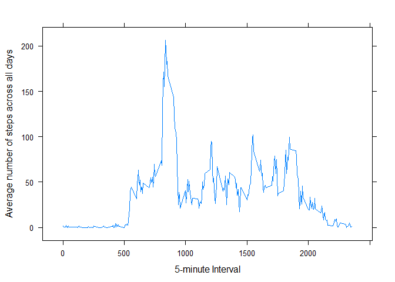

# Reproducible Research: Peer Assessment 1

The very first step is to load and preprocess the data and for this we need to go step by step as per the instructions. We load unzip the file, read the file into R. In the same step loading the dplyr library to group the dataframe by date to make the necessary manipulations on the data.


## Loading and preprocessing the data


```r
activity<- read.csv("~/repdata/RepData_PeerAssessment1/activity.csv", header = TRUE, stringsAsFactors = FALSE)
```


## Group the activities by date to make the manipulation on data easy


```r
activity_day<-group_by(activity, date)
```

## What is mean total number of steps taken per day?

The mean total number of steps are 

```r
sum_day<-summarise(activity_day, sum = sum(steps))
```

## Make a histogram of the total number of steps taken each day


```r
histogram(~sum, sum_day, xlab = 'Number of Steps taken per Day')
```

 

##Calculate and report the mean and median of the total number of steps taken per day

The mean and median are

```r
mean_median<-summarise(sum_day, mean = mean(sum, na.rm = TRUE), median = median(sum, na.rm = TRUE))
```

## What is the average daily activity pattern?


A time series plot

```r
activity_time<-group_by(activity, interval)
avg_int<-summarise(activity_time, average = mean(steps, na.rm = TRUE))
xyplot(average~interval, avg_int, type = "l", xlab = "5-minute Interval", ylab = "Average number of steps across all days")
```

 

##Which 5-minute interval, on average across all the days in the dataset, contains the maximum number of steps?

The maximum number of steps are in 

```r
avg_int[which.max(avg_int$average),]
```

```
## Source: local data frame [1 x 2]
## 
##   interval  average
## 1      835 206.1698
```


###Imputing missing values


##Calculate and report the total number of missing values in the dataset (i.e. the total number of rows with NAs)


```r
summary(activity)
```

```
##      steps            date              interval     
##  Min.   :  0.00   Length:17568       Min.   :   0.0  
##  1st Qu.:  0.00   Class :character   1st Qu.: 588.8  
##  Median :  0.00   Mode  :character   Median :1177.5  
##  Mean   : 37.38                      Mean   :1177.5  
##  3rd Qu.: 12.00                      3rd Qu.:1766.2  
##  Max.   :806.00                      Max.   :2355.0  
##  NA's   :2304
```

```r
sum(is.na(activity))
```

```
## [1] 2304
```

##Devise a strategy for filling in all of the missing values in the dataset. The strategy does not need to be sophisticated. For example, you could use the mean/median for that day, or the mean for that 5-minute interval, etc.


## Imputing missing values


## Are there differences in activity patterns between weekdays and weekends?
